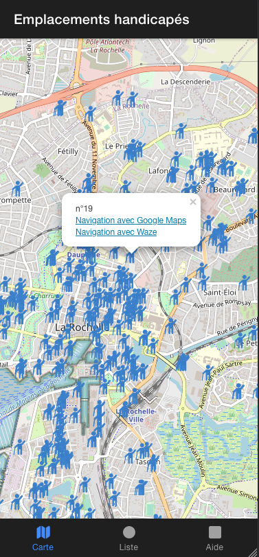

# Application mobile Handicap La Rochelle


Une application mobile utilisant les données OpenData de la ville de la rochelle.

https://opendata.agglo-larochelle.fr/visualisation/information/?id=d7ea2b60-33df-4ce3-ac8b-13344defc666


Paris:
https://www.paris.fr/pages/le-stationnement-pour-les-personnes-en-situation-de-handicap-7844

Grand Paris:
https://www.data.gouv.fr/fr/datasets/places-de-stationnement-pmr/

# Objectifs:
* Fournir aux personnes concernés les emplacements des stationemments handicapés
* Proposer un itinéraire vers la place handicapé la plus proche

# Technologies

* Ionic
* Vue JS
* MongoDB (pour le stockage)
* Leaflet (affichage de la carte)

# Dépendances

```bash
npm install
```
# Utilisation

* Lancement d'une version de dev
ionic serve 